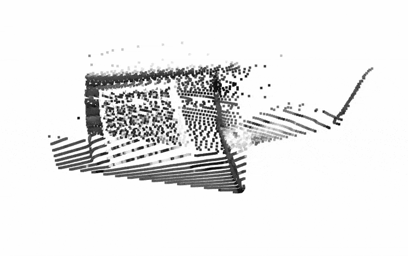

# Monocular Visual-Inertial SLAM for 3D Mapping

As part of my thesis, I was supposed to create an autonomous drone for vineyard surveillance and mapping. Unfortunately, I could not complete the entire system within the scope of the thesis. However, the work that was completed on the SLAM (Simultaneous Localization and Mapping) system forms the core of this repository. This project focuses on monocular visual-inertial SLAM for 3D mapping and localization, which is one of the fundamental components of the larger goal of autonomous drone navigation and mapping. 

The remaining work on autonomous navigation and full system integration will be pursued as a hobby project in the future.

## Features

- **Visual-Inertial Odometry**: Estimates the camera's motion.
- **Good-Enough Metric Scale Estimation**: Integrates IMU data with monocular vision to resolve scale ambiguity and generate realistically scaled 3D maps
- **Dense 3D Mapping**: Reconstructs the environment as a point cloud.
- **Loop Closure Support**: Detects revisited locations to reduce long-term drift (no correction currently).
- **Dataset and Real-World Compatibility**: Works with datasets like EuRoC MAV or real drone recordings.

## Limitations

- Drift accumulation.
- no pose graph and map correction after loop closure.
- Sensitive to camera quality and IMU noise.
- 5fps not good enough for real-time use

## TODO

- Add pose graph optimization and map correction
- Sensor fusion for imu and camera for accurate pose estimation
- Extend the speed to atleast 10-15fps for realtime application

## 📹 Mapping Demonstrations

Here are some sample results showing the progress of the SLAM system during testing.

### EuRoC MAV Dataset Mapping
- Monocular visual-inertial SLAM tested on the EuRoC MAV dataset.
- Partial 3D point cloud reconstruction with noticeable drift.

  

    
    &nbsp;&nbsp;
    
  

  
Single frame reconstruction

  

    
    &nbsp;&nbsp;
    
  

  
 Partial mapping 

  
  
  
